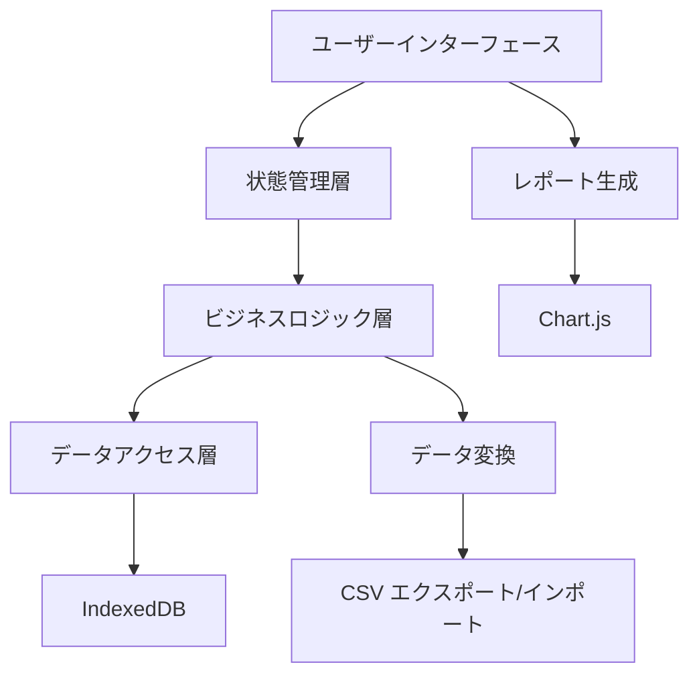

# 設計書

## 概要

会計アプリは、Webベースのシングルページアプリケーション（SPA）として設計します。フロントエンドにReact、状態管理にRedux Toolkit、データストレージにIndexedDBを使用し、レスポンシブデザインでモバイル・デスクトップ両対応とします。

## アーキテクチャ

### システム構成



### 技術スタック

- **フロントエンド**: React 18 + TypeScript
- **状態管理**: Redux Toolkit + RTK Query
- **UI コンポーネント**: Material-UI (MUI)
- **データベース**: IndexedDB (Dexie.js)
- **チャート**: Chart.js + react-chartjs-2
- **日付処理**: date-fns
- **バリデーション**: Yup + Formik
- **テスト**: Jest + React Testing Library

## コンポーネントとインターフェース

### 主要コンポーネント

#### 1. レイアウトコンポーネント
- `AppLayout`: メインレイアウト、ナビゲーション
- `Sidebar`: サイドバーナビゲーション
- `Header`: ヘッダー、ユーザー情報表示

#### 2. 取引管理コンポーネント
- `TransactionList`: 取引一覧表示
- `TransactionForm`: 取引入力・編集フォーム
- `TransactionFilter`: 検索・フィルター機能
- `TransactionItem`: 個別取引表示

#### 3. カテゴリ管理コンポーネント
- `CategoryManager`: カテゴリ管理画面
- `CategoryForm`: カテゴリ作成・編集
- `CategorySelector`: カテゴリ選択ドロップダウン

#### 4. レポートコンポーネント
- `Dashboard`: ダッシュボード画面
- `MonthlyReport`: 月次レポート
- `CategoryReport`: カテゴリ別レポート
- `ChartContainer`: グラフ表示コンテナ

#### 5. データ管理コンポーネント
- `DataExport`: データエクスポート機能
- `DataImport`: データインポート機能
- `BackupManager`: バックアップ管理

### API インターフェース

#### Transaction Service
```typescript
interface TransactionService {
  createTransaction(transaction: CreateTransactionDto): Promise<Transaction>
  updateTransaction(id: string, transaction: UpdateTransactionDto): Promise<Transaction>
  deleteTransaction(id: string): Promise<void>
  getTransactions(filter?: TransactionFilter): Promise<Transaction[]>
  getTransactionById(id: string): Promise<Transaction>
}
```

#### Category Service
```typescript
interface CategoryService {
  createCategory(category: CreateCategoryDto): Promise<Category>
  updateCategory(id: string, category: UpdateCategoryDto): Promise<Category>
  deleteCategory(id: string): Promise<void>
  getCategories(): Promise<Category[]>
  getCategoryById(id: string): Promise<Category>
}
```

#### Report Service
```typescript
interface ReportService {
  getMonthlyReport(year: number, month: number): Promise<MonthlyReport>
  getCategoryReport(startDate: Date, endDate: Date): Promise<CategoryReport>
  getYearlyReport(year: number): Promise<YearlyReport>
}
```

## データモデル

### Transaction（取引）
```typescript
interface Transaction {
  id: string
  date: Date
  amount: number // 正の値：収入、負の値：支出
  description: string
  categoryId: string
  type: 'income' | 'expense'
  createdAt: Date
  updatedAt: Date
}
```

### Category（カテゴリ）
```typescript
interface Category {
  id: string
  name: string
  color: string
  type: 'income' | 'expense' | 'both'
  isDefault: boolean
  createdAt: Date
  updatedAt: Date
}
```

### MonthlyReport（月次レポート）
```typescript
interface MonthlyReport {
  year: number
  month: number
  totalIncome: number
  totalExpense: number
  balance: number
  categoryBreakdown: CategorySummary[]
  transactionCount: number
}
```

### CategorySummary（カテゴリ集計）
```typescript
interface CategorySummary {
  categoryId: string
  categoryName: string
  amount: number
  percentage: number
  transactionCount: number
}
```

## エラーハンドリング

### エラー分類
1. **バリデーションエラー**: 入力値の検証失敗
2. **データベースエラー**: IndexedDBアクセス失敗
3. **ビジネスロジックエラー**: 業務ルール違反
4. **システムエラー**: 予期しない例外

### エラー処理戦略
- **グローバルエラーハンドラー**: Redux middlewareでエラーを一元管理
- **ユーザーフレンドリーメッセージ**: 技術的詳細を隠し、分かりやすいメッセージを表示
- **エラーログ**: 開発者向けの詳細ログをコンソールに出力
- **リトライ機能**: 一時的な障害に対する自動リトライ

### エラー表示
```typescript
interface ErrorState {
  message: string
  type: 'validation' | 'database' | 'business' | 'system'
  field?: string // バリデーションエラーの場合
  retryable: boolean
}
```

## テスト戦略

### テストピラミッド
1. **ユニットテスト（70%）**
   - ビジネスロジック関数
   - Redux reducers/actions
   - ユーティリティ関数

2. **統合テスト（20%）**
   - コンポーネント間の連携
   - データベースアクセス
   - API呼び出し

3. **E2Eテスト（10%）**
   - 主要ユーザーフロー
   - クリティカルパス

### テスト実装
- **コンポーネントテスト**: React Testing Libraryを使用
- **状態管理テスト**: Redux storeのテスト
- **データベーステスト**: IndexedDBのモック化
- **スナップショットテスト**: UIコンポーネントの回帰テスト

### テストデータ
- **ファクトリーパターン**: テストデータ生成の標準化
- **モックデータ**: 一貫性のあるテストデータセット
- **テストフィクスチャ**: 複雑なシナリオ用の事前定義データ

## パフォーマンス考慮事項

### 最適化戦略
1. **コード分割**: React.lazy()による動的インポート
2. **メモ化**: React.memo、useMemo、useCallbackの活用
3. **仮想化**: 大量データ表示時のReact Windowの使用
4. **データキャッシュ**: RTK Queryによる効率的なキャッシュ管理

### データベース最適化
- **インデックス**: 検索頻度の高いフィールドにインデックス作成
- **ページネーション**: 大量データの分割読み込み
- **バックグラウンド処理**: 重い処理の非同期実行